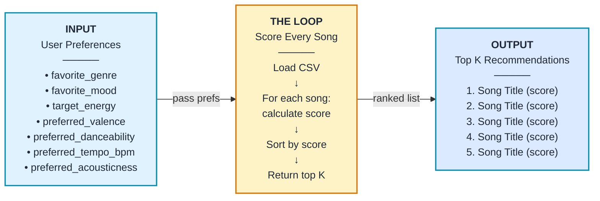
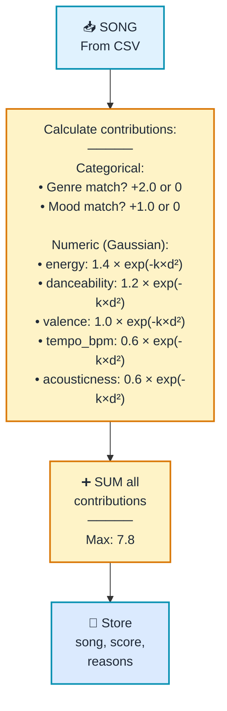
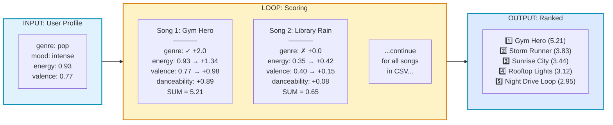

# Song Recommender Data Flow

## Overview


---

## The Loop in Detail

### How Each Song Gets Scored



---

## Scoring Algorithm: Option D (Balanced Discovery)

### Weights Table

| Feature | Weight | Scoring Method |
|---------|--------|-----------------|
| **Genre** | 2.0 | Exact match: +2.0 if match, 0 otherwise |
| **Mood** | 1.0 | Exact match: +1.0 if match, 0 otherwise |
| **Energy** | 1.4 | Gaussian: 1.4 × exp(-k × distance²) |
| **Danceability** | 1.2 | Gaussian: 1.2 × exp(-k × distance²) |
| **Valence** | 1.0 | Gaussian: 1.0 × exp(-k × distance²) |
| **Tempo (BPM)** | 0.6 | Gaussian: 0.6 × exp(-k × distance²) |
| **Acousticness** | 0.6 | Gaussian: 0.6 × exp(-k × distance²) |
| **MAX SCORE** | **7.8** | Sum of all contributions |

### Formula
```
TOTAL_SCORE = genre_contrib + mood_contrib + energy_contrib + 
              danceability_contrib + valence_contrib + 
              tempo_contrib + acousticness_contrib

Where:
  • genre_contrib = 2.0 if (song.genre == user.favorite_genre) else 0
  • mood_contrib = 1.0 if (song.mood == user.favorite_mood) else 0
  • numeric_contrib = weight × exp(-k × (user_pref - song_value)²)
  • k = tuning_param (0.5=loose/forgiving, 1.0=standard, 2.0=strict)
```

---

## Example: Full Flow for a High-Energy User



---

## Key Insights

**🎯 Every Song Is Independent**  
The loop doesn't compare songs to each other—each song is scored individually against the user's preferences using the same formula.

**🔄 The Loop Pattern**
1. Load all songs from CSV
2. For each song: calculate score (0–7.8 max)
3. After all songs scored: sort by score (descending)
4. Return top K songs with explanations

**⚙️ Tuning the Gaussian (k parameter)**
- `k = 0.5`: Loose/forgiving — songs far from user pref still score well
- `k = 1.0`: Standard — balanced match/discovery
- `k = 2.0`: Strict — only songs very close to user pref score high

**🎭 Categorical vs. Numeric**
- **Genre & Mood**: All-or-nothing exact matches (0 or full weight)
- **Audio Features**: Soft Gaussian similarity (reward closeness, don't punish difference)
